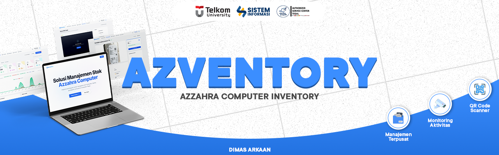

<div align="center">

<!-- Banner Section -->


# 📦 Azventory
### (Azzahra Computer Inventory)

[](https://laravel.com)
[](https://php.net)
[](https://tailwindcss.com)
[](#)

Aplikasi manajemen stok dan inventaris yang dikembangkan khusus untuk **CV Azzahra Computer**. 
Sistem ini dirancang sebagai implementasi **Tugas Akhir** dalam bidang sistem informasi.

</div>

---

## 📋 Deskripsi Proyek
**Azventory** merupakan sistem informasi yang berfungsi untuk mendokumentasikan alur masuk dan keluar barang, monitoring stok, serta pengelolaan peminjaman inventaris. Nama Azventory sendiri diambil dari akronim *Azzahra Computer Inventory*.

Sistem ini ditujukan untuk mempermudah administrasi pergudangan dengan menerapkan metodologi pencatatan digital yang menggantikan proses manual.

## 🚀 Fitur Utama
Sistem ini mencakup berbagai modul fungsional yang saling terintegrasi:

- 🔐 **Manajemen Hak Akses (RBAC)**: Pembagian akses data berbasis peran (Superadmin, Admin, dan Operator).
- 📦 **Pengelolaan Stok**: Pencatatan mutasi barang masuk dan keluar secara terorganisir.
- 🤝 **Modul Peminjaman**: Pendataan barang yang dipinjam beserta riwayat pengembalian dan kondisi fisik barang.
- 📊 **Monitoring Kritis**: Identifikasi otomatis untuk barang yang stoknya di bawah batas minimum (Threshold).
- 🏷️ **Integrasi QR Code**: Sistem pendataan barang menggunakan kode QR untuk mempermudah identifikasi unit.
- 📄 **Pelaporan Terpadu**: Fasilitas pembuatan laporan periodik dalam format PDF (Kop Surat) dan Excel.
- 🔗 **API Gateway**: Kesiapan integrasi data dengan aplikasi pihak ketiga melalui RESTful API.

## 🛠️ Arsitektur Teknologi
Sistem dibangun di atas fondasi teknologi modern untuk memastikan kemudahan pemeliharaan:

| Layer | Teknologi |
| --- | --- |
| **Backend** | [Laravel 11](https://laravel.com) (PHP 8.2+) |
| **Frontend** | [Tailwind CSS](https://tailwindcss.com) & [Alpine.js](https://alpinejs.dev) |
| **Database** | MySQL / MariaDB |
| **Keamanan** | Laravel Sanctum (API Tokens) & Spatie ActivityLog |

## 💻 Panduan Instalasi Lokal

### 1. Prasyarat Sistem
- PHP versi 8.2 atau lebih tinggi
- Composer
- Node.js & NPM
- MySQL Database Engine

### 2. Langkah Instalasi
```bash
# Clone repositori
git clone https://github.com/Username-Anda/AzventoryWeb.git

# Masuk ke folder proyek
cd AzventoryWeb

# Pasang dependensi
composer install
npm install

# Proses kompilasi aset frontend
npm run build
```

### 3. Konfigurasi Sistem
1. Salin file `.env.example` menjadi `.env`.
2. Generate kunci keamanan: `php artisan key:generate`.
3. Atur parameter koneksi database pada file `.env`.
4. Jalankan perintah migrasi dan input data awal:
   ```bash
   php artisan migrate --force --seed
   ```

### 4. Eksekusi
Jalankan server lokal melalui perintah:
```bash
php artisan serve
```
Akses sistem melelui browser di alamat `http://127.0.0.1:8000`.

---

## 🔑 Akses Akun (Default Seeding)
- **Superadmin**: superadmin@azventory.com (Password: `password`)
- **Admin**: admin@azventory.com (Password: `password`)
- **Operator**: operator@azventory.com (Password: `password`)

## 📚 Dokumentasi Teknis
Tersedia panduan khusus untuk operasional dan pengembangan lanjutan:
- [Tutorial Integrasi API](./Panduan_Integrasi_API.md)
- [Instruksi Pembaruan Sistem di cPanel](./Panduan_Pembaruan_Sistem.md)
- [Checklist Kesiapan Produksi](./Production_Readiness.md)

---
*Proyek ini dikembangkan dalam rangka pemenuhan syarat Tugas Akhir Program Studi Sistem Informasi.*
